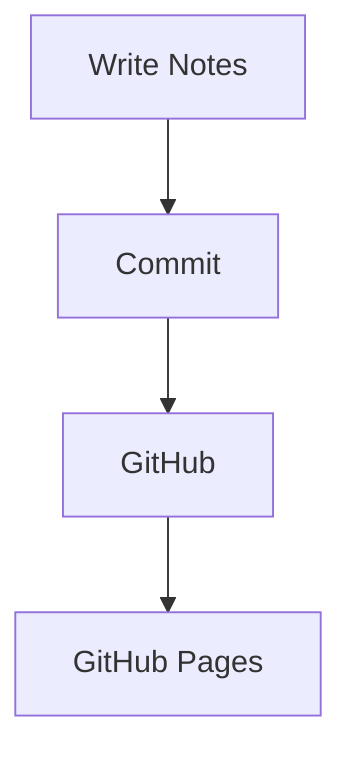

---
# ==========================================================
# Required fields
# ==========================================================

title: "Building a Personal Linux Knowledge Base"
# The title displayed on the homepage and the post page.

date: 2026-07-06 20:30:00 +0300
# Publication date and timezone.

categories: [Linux, Knowledge-Base]
# Up to two categories.
# First = main category
# Second = sub-category

tags:
  - linux
  - emacs
  - orgmode
  - github
  - documentation
  - devops
# Unlimited tags.
# Recommended to use lowercase.

# ==========================================================
# Author
# ==========================================================

#author: arman
# Uses the "arman" entry from _data/authors.yml

# authors:
#   - arman
#   - cotes
# Alternative: multiple authors.

# ==========================================================
# Summary
# ==========================================================

description: >
  A complete walkthrough of creating a personal Linux
  documentation website using Chirpy, Jekyll,
  GitHub Pages, Org Mode and Emacs.
# Short summary shown on the homepage,
# RSS feed and under the title.

# ==========================================================
# Preview image
# ==========================================================

#image:
  #path: cover.webp
#alt: Screenshot of the final knowledge base homepage.
 # lqip: cover-lqip.webp
# path  : preview image
# alt   : accessibility text
# lqip  : low-quality placeholder while loading

# Simple form:
# image: cover.webp

# ==========================================================
# Media
# ==========================================================

#media_subpath: /assets/posts/linux-kb
# Prefix automatically added to images/videos/audio
# inside this post.

# ==========================================================
# Table of Contents
# ==========================================================

toc: true
# true  = show TOC
# false = hide TOC for this post

# ==========================================================
# Comments
# ==========================================================

comments: true
# Enable or disable comments for this post.
# Requires a comment system configured globally.

# ==========================================================
# Mathematics
# ==========================================================

math: false
# Loads MathJax only when needed.

# ==========================================================
# Mermaid diagrams
# ==========================================================

mermaid: true
# Enables Mermaid.js diagrams.

# ==========================================================
# Pinning
# ==========================================================

pin: false
# If true, this post stays at the top
# of the homepage.

# ==========================================================
# Published
# ==========================================================

published: true
# false = draft (Jekyll won't publish it)

# ==========================================================
# Layout (optional)
# ==========================================================

# layout: post
# Already the default in Chirpy.

---
# Introduction

Welcome to my Linux knowledge base.

> This article is updated regularly.
{: .prompt-info }

> Always keep backups before changing your system.
{: .prompt-warning }

> Test everything inside a VM first.
{: .prompt-tip }

> Never blindly copy commands from the Internet.
{: .prompt-danger }

---

## Image

_The generated homepage._

---

## Floating image
This paragraph flows around the image.

---

## Shadow
---

## Dark / Light images
---

## Code

```bash
git clone https://github.com/arthas-lich/arthas-lich.github.io
bundle exec jekyll serve
```

---

## File path

`~/.config/alacritty/alacritty.toml`{: .filepath}

---

## Inline code

Run `bundle exec jekyll serve`.

---

## Mathematics

$$
f(x)=x^2+1
$$

Inline equation:

$$x^2+y^2=z^2$$

---

## Mermaid



---

## Table

| Tool | Purpose |
|------|---------|
| Emacs | Writing |
| Git | Version control |
| Chirpy | Blog theme |
| GitHub Pages | Hosting |

---

## Task list

- [x] Install Jekyll
- [x] Configure Chirpy
- [ ] Publish first article
- [ ] Add search

---

## Quote

> Simplicity is prerequisite for reliability.

---

## Footnote

Linux is fun.[^1]

[^1]: Especially when documented well.
a
